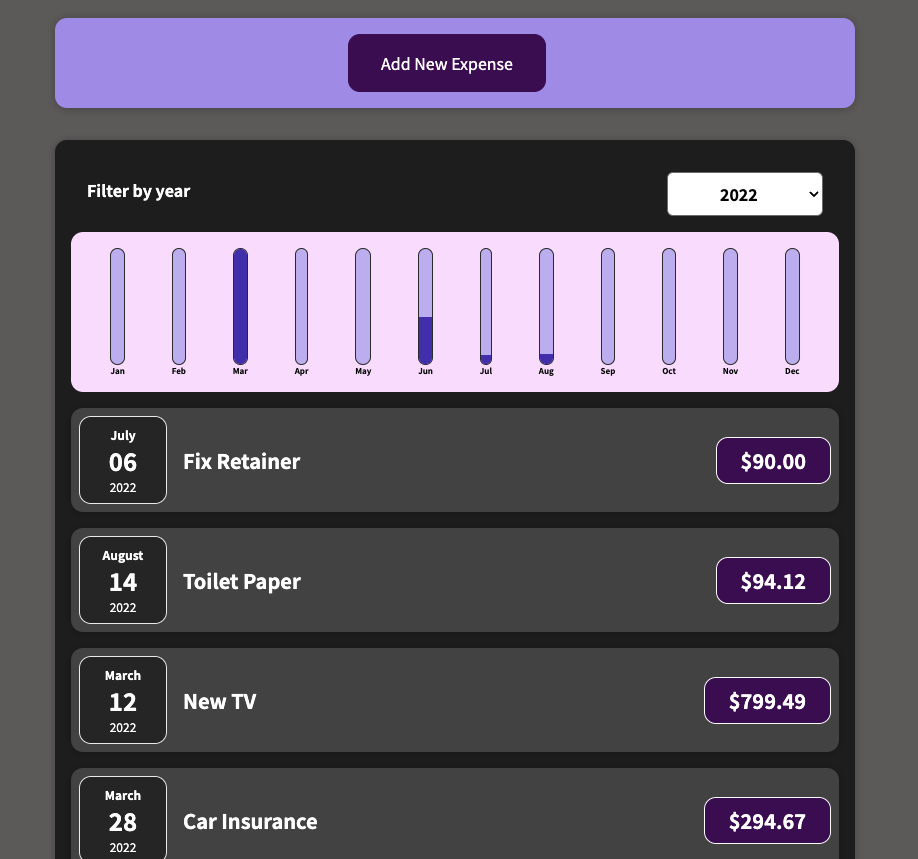

# Static React Expense Tracker

## Site Preview:

  

## Description

Component driven UI Expense Tracker with jsx syntax. User is able to add new items to the tracker with the prices and dates of each item.

